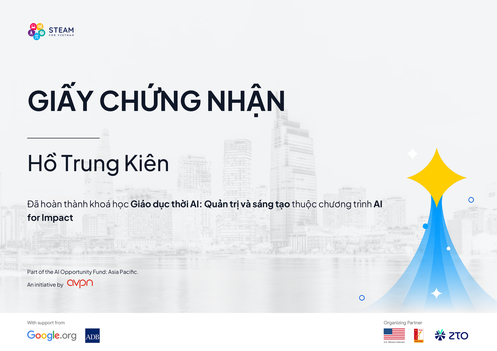
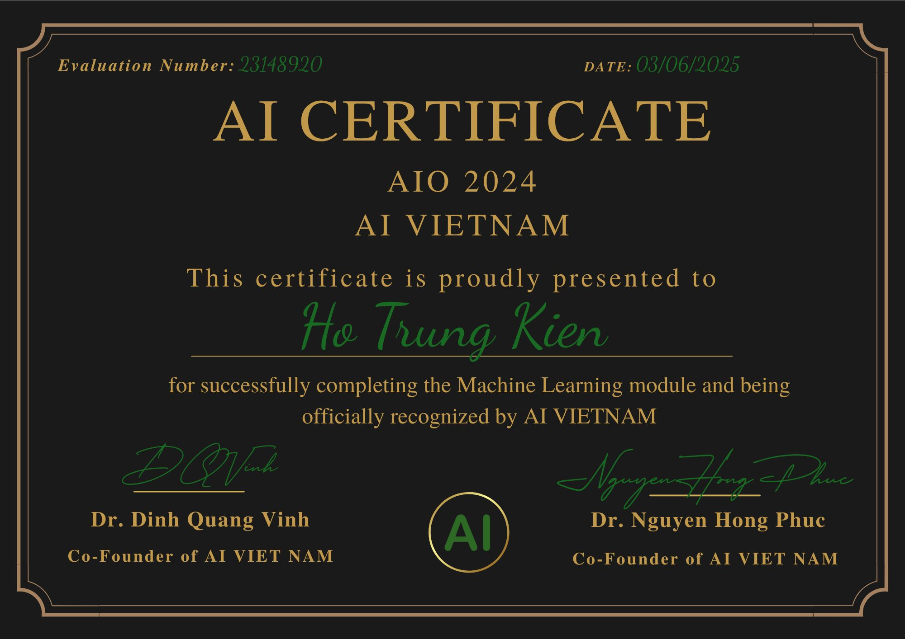
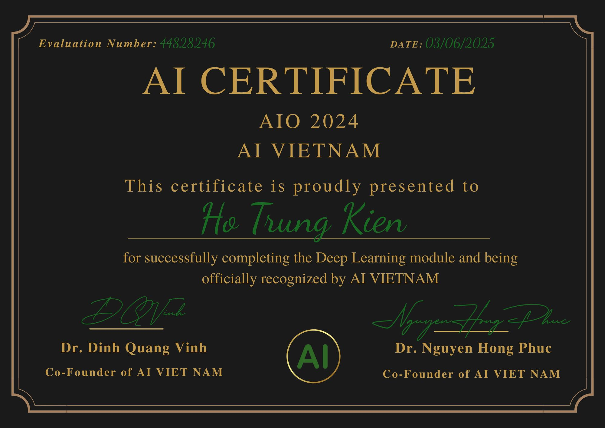
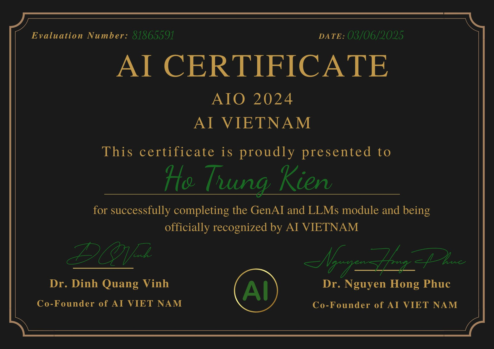

<!-- Header -->
<div align="center">

<a href="https://github.com/Kein95">
  
</a>

</div>

<!-- About Me -->

## 👨‍💻 About Me

Xin chào! I'm **Kien**, a Vietnam-based **vibe coder**: I build fast by pairing with AI, then test, review, and harden every line until it ships.

I build config-driven toolkits that turn "bring your own data + template" into
"deployable portal in an afternoon." Current focus: certificate issuance, QR
verification, shipment tracking, and public honor-roll showcases. It's the
boring-but-important infrastructure behind competitions, training programs, and
award cohorts.

**🚀 Shipped**

- [`LUONVUITUOI-CERT`](https://github.com/Kein95/luonvuituoi-cert): full-stack cert portal toolkit (Python + Flask + MkDocs Material, bilingual EN/VI docs, Vercel + Docker deploy)
- [`LUONVUITUOI-HONOR ROLL`](https://github.com/Kein95/luonvuituoi-honor-roll): config-driven student honor-roll toolkit (search, Hall of Fame, team awards, admin) with a [live demo](https://honor-roll-vercel-demo.vercel.app) on Vercel
- [`LUONVUITUOI-LPR-DATAHUB`](https://github.com/Kein95/luonvuituoi-lpr-datahub): all-in-one gateway for License Plate Recognition research (16+ datasets, 10+ countries)

**🛠️ Stack**: Python, Flask, SQLite, Pydantic, openpyxl, reportlab, Docker, Vercel, MkDocs Material

**🌱 Exploring**: Computer Vision, LPR datasets, Supabase, Cloudflare R2, FastAPI

**🧭 Mentor**: [@duongtruongbinh](https://github.com/duongtruongbinh), AI Researcher at AI Vietnam

**🤝 Teammate**: [@Liamlenguyen](https://github.com/Liamlenguyen). Farewell, and wishing you success on the path you've chosen ✨

## 🏆 Achievements

| Year | Program / Competition | Focus | Result |
|------|-------------|-------|--------|
| 2026 | [ICPR 2026 Competition on Low-Resolution License Plate Recognition](https://www.codabench.org/competitions/12259/) | License plate recognition on low-resolution imagery | 🏆 **#20 of 99** (269 teams · 41 countries) |
| 2026 | [JOAI2026: 2nd Japanese Olympiad in AI](https://ioai-japan.org/) | Open category | 🏅 **Honorable Mention** (努力賞) |
| 2026 | [AI for Impact: Giáo dục thời AI](https://steamforvietnam.org/) | Quản trị & sáng tạo trong thời đại AI | **Completed course** |
| 2024&#8209;2025 | [AI Vietnam AIO2024](https://aivietnam.edu.vn/) | Data Science and Artificial Intelligence All-In-One course | **Completed course** |

### 🚘 ICPR 2026 Competition on Low-Resolution License Plate Recognition

<div align="center">

As team **AIO_RIVA_RICE**, I placed **#20 of 99 valid submissions** (269 teams from 41 countries) in the **ICPR 2026 Competition on Low-Resolution License Plate Recognition**, reaching a recognition rate of **76.47%**. The task: reading license plates from heavily degraded, low-resolution imagery (the **LRLPR-26** dataset).
<br>
🔎 Leaderboard: [Codabench results](https://www.codabench.org/competitions/12259/#/results-tab) &nbsp;·&nbsp; 📄 Report: [arXiv:2604.22506](https://arxiv.org/abs/2604.22506) &nbsp;·&nbsp; 🔗 Related: [LUONVUITUOI-LPR-DATAHUB](https://github.com/Kein95/luonvuituoi-lpr-datahub)

</div>

> **🙏 Please support and cite the authors.** The competition report ([arXiv:2604.22506](https://arxiv.org/abs/2604.22506)) credits the **top 5 teams** as named co-authors. Teams ranked **6th to 20th**, including mine, contributed results but are not listed as authors. I'm noting this for transparency: my name is **not** on the paper, and full credit goes to the authors below.

<details>
<summary>📌 Authors & citation (BibTeX)</summary>

**Authors:** Rayson Laroca, Valfride Nascimento, Donggun Kim, Sanghyeok Chung, Subin Bae, Uihwan Seo, Seungsang Oh, Chi M. Phung, Minh G. Vo, Xingsong Ye, Yongkun Du, Yuchen Su, Zhineng Chen, Sunhee Heo, Hyangwoo Lee, Kihyun Na, Khanh V. Vu Nguyen, Sang T. Pham, Duc N. N. Phung, Trong P. Le, Vy N. Vo Tran, David Menotti.

```bibtex
@article{laroca2026lrlpr,
  title   = {{ICPR} 2026 Competition on Low-Resolution License Plate Recognition},
  author  = {Rayson Laroca and Valfride Nascimento and Donggun Kim and Sanghyeok Chung and Subin Bae and Uihwan Seo and Seungsang Oh and Chi M. Phung and Minh G. Vo and Xingsong Ye and Yongkun Du and Yuchen Su and Zhineng Chen and Sunhee Heo and Hyangwoo Lee and Kihyun Na and Khanh V. Vu Nguyen and Sang T. Pham and Duc N. N. Phung and Trong P. Le and Vy N. Vo Tran and David Menotti},
  journal = {arXiv preprint arXiv:2604.22506},
  year    = {2026}
}
```

</details>

### 🏅 JOAI2026: 2nd Japanese Olympiad in AI

<div align="center">

<a href="./JOAI2026_KIEN_努力賞.pdf">
  
</a>

<sub>📜 Click to download the signed PDF</sub>

</div>

### 🎓 AI for Impact: Giáo dục thời AI

<div align="center">

"Giáo dục thời AI: Quản trị và sáng tạo", part of the **AI for Impact** program under the **AI Opportunity Fund: Asia Pacific**.
<br>
🤝 An initiative by **AVPN**, organized by **STEAM for Vietnam**, with support from **Google.org**, **ADB** and **U.S. Mission Vietnam**.
<br>
✅ Verify certificate: [eduone.ai verification portal](https://lms.eduone.ai/certificates/1058862c5c8a474c994443116571d568)
<br><br>

<a href="./ai_for_impact_giao_duc_thoi_ai_ho_trung_kien.pdf">
  
</a>

<br>
<sub>📜 Click to download the signed PDF</sub>

</div>

### 🎓 AI Vietnam AIO2024

<div align="center">

AIO2024 is AI Vietnam's All-In-One course for Data Science and Artificial Intelligence.
<br>
🎓 Completed the course and earned three certificates: Machine Learning, Deep Learning, and GenAI/LLM.
<br>
🌐 Public channels: [AI Vietnam website](https://aivietnam.edu.vn/) · [Facebook fanpage](https://www.facebook.com/aivietnam.edu.vn)
<br>
✅ Verify certificates: [Certificate verification portal](https://lms.aivietnam.edu.vn/verification)
<br><br>

<a href="./0306/certificate_machine_learning_ho_trung_kien_23148920.png"></a>
<a href="./0306/certificate_deep_learning_ho_trung_kien_44828246.png"></a>
<a href="./0306/certificate_genai_llm_ho_trung_kien_81865591.png"></a>
<br>
<sub>🔎 Click each certificate image to view full size</sub>

</div>

## 📌 Pinned

<table>
<tr>
<td width="50%">

### [🏆 LUONVUITUOI-HONOR ROLL](https://github.com/Kein95/luonvuituoi-honor-roll)

Config-driven student honor-roll toolkit. Public award gallery, student
search, all-time Hall of Fame, team awards, and a password-protected
admin. Bilingual docs, animated UI, login hardening (rate-limit + CSRF + audit).


[→ Live demo](https://honor-roll-vercel-demo.vercel.app) &nbsp;·&nbsp;
[→ Docs](https://kein95.github.io/luonvuituoi-honor-roll/)

</td>
<td width="50%">

### [🎓 LUONVUITUOI-CERT](https://github.com/Kein95/luonvuituoi-cert)

Config-driven certificate portal toolkit. Bring your PDF template +
student list → public lookup, admin panel, QR verify, bulk shipment
import/export. MIT license, 460+ tests, bilingual docs.


[→ Live docs](https://kein95.github.io/luonvuituoi-cert/) &nbsp;·&nbsp;
[→ Docs VI](https://kein95.github.io/luonvuituoi-cert/vi/)

</td>
</tr>
<tr>
<td width="50%">

### [🚘 LUONVUITUOI-LPR-DATAHUB](https://github.com/Kein95/luonvuituoi-lpr-datahub)

All-in-one gateway for License Plate Recognition research: 16+ datasets
across 10+ countries, unified metadata, quick-start notebooks.


Mentored by [@duongtruongbinh](https://github.com/duongtruongbinh), AI
Researcher at AI Vietnam.

</td>
<td width="50%">

<sub>🔭 Browse every repository on [github.com/Kein95](https://github.com/Kein95?tab=repositories).</sub>

</td>
</tr>
</table>

## 📬 Contact

| Channel | Link |
|---------|------|
| 📧 Email | [htkien95@gmail.com](mailto:htkien95@gmail.com) · [htkien95@luonvuituoi.work](mailto:htkien95@luonvuituoi.work) |
| 📱 Phone / Zalo | [+84 348 635 408](tel:+84348635408) |
| 🐙 GitHub | [@Kein95](https://github.com/Kein95) |
| 🌐 Live projects | [honor-roll demo](https://honor-roll-vercel-demo.vercel.app) · [luonvuituoi-cert docs](https://kein95.github.io/luonvuituoi-cert/) · [lpr-dataset-hub](https://lpr-dataset-hub.vercel.app/) |

---

<div align="center">

<sub>🧭 Mentor <a href="https://github.com/duongtruongbinh">@duongtruongbinh</a> &nbsp;·&nbsp; 🤝 Teammate <a href="https://github.com/Liamlenguyen">@Liamlenguyen</a></sub>
<br>
<sub>Farewell to our teammate <a href="https://github.com/Liamlenguyen">@Liamlenguyen</a>. Wishing you success on the path you've chosen ✨</sub>


</div>
