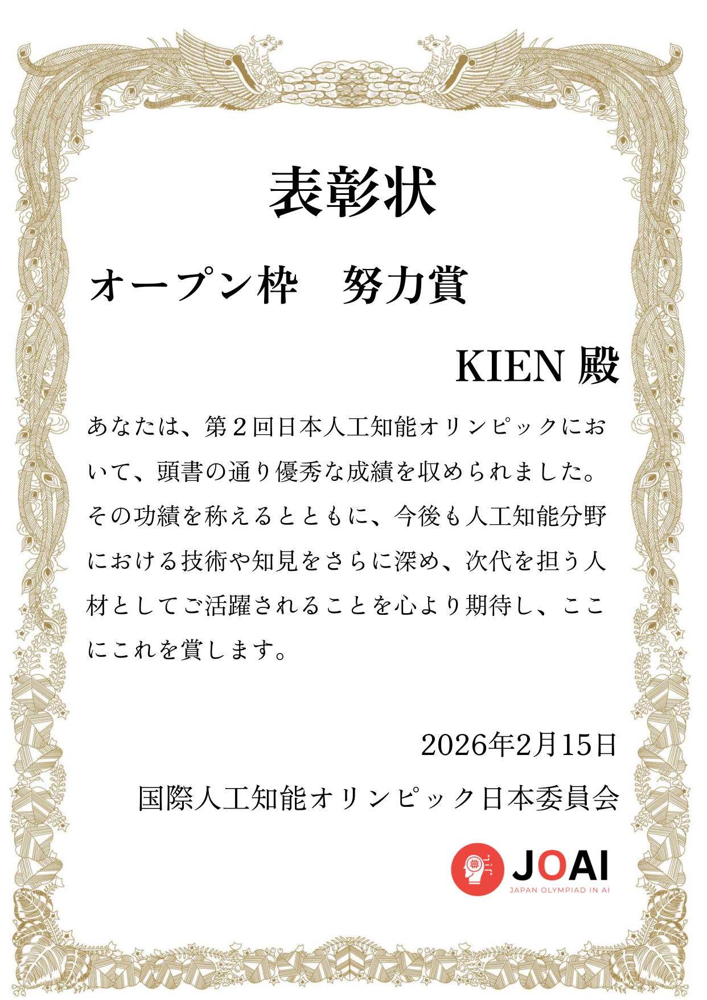

<!-- Header -->

<!-- About Me -->

## 👨‍💻 About Me

Xin chào! I'm **Kien** — based in 🇻🇳 Vietnam.

I build config-driven toolkits that turn "bring your own data + template" into
"deployable portal in an afternoon." Current focus: certificate issuance, QR
verification, shipment tracking — the boring-but-important infrastructure
behind competitions, training programs, and award cohorts.

- 🚀 **Shipped**:
  - [`LUONVUITUOI-CERT`](https://github.com/Kein95/luonvuituoi-cert) — full-stack cert portal toolkit (Python + Flask + MkDocs Material, bilingual EN/VI docs, Vercel + Docker deploy)
  - [`LUONVUITUOI-LPR-DATAHUB`](https://github.com/Kein95/luonvuituoi-lpr-datahub) — all-in-one gateway for License Plate Recognition research (16+ datasets, 10+ countries)
- 🛠️ **Stack**: Python, Flask, SQLite, Pydantic, openpyxl, reportlab, Docker, Vercel, MkDocs Material
- 🌱 **Exploring**: Computer Vision, LPR datasets, Supabase, Cloudflare R2, FastAPI
- 🧭 **Mentor**: [@duongtruongbinh](https://github.com/duongtruongbinh) — AI Researcher at AI Vietnam
- 🤝 **Teammate**: [@Liamlenguyen](https://github.com/Liamlenguyen) — watch for more **LUONVUITUOI TEAM** collabs ✨

## 🏆 Achievements

| Year | Competition | Track | Result |
|------|-------------|-------|--------|
| 2026 | [JOAI2026 — 2nd Japanese Olympiad in AI](https://joai.jp/) | Open | 🥉 **Honorable Mention** (努力賞) |

📜 Click to download the signed PDF

## 📌 Pinned

<table>
<tr>
<td width="50%">

### [🎓 LUONVUITUOI-CERT](https://github.com/Kein95/luonvuituoi-cert)

Config-driven certificate portal toolkit. Bring your PDF template +
student list → public lookup, admin panel, QR verify, bulk shipment
import/export. MIT license, 460+ tests, bilingual docs.

[→ Live docs](https://kein95.github.io/luonvuituoi-cert/) &nbsp;·&nbsp;
[→ Docs VI](https://kein95.github.io/luonvuituoi-cert/vi/)

</td>
<td width="50%">

### [🚘 LUONVUITUOI-LPR-DATAHUB](https://github.com/Kein95/luonvuituoi-lpr-datahub)

All-in-one gateway for License Plate Recognition research — 16+ datasets
across 10+ countries, unified metadata, quick-start notebooks.

Mentored by [@duongtruongbinh](https://github.com/duongtruongbinh) — AI
Researcher at AI Vietnam. More from **LUONVUITUOI TEAM** coming.

</td>
</tr>
</table>

## 📊 GitHub Stats

 

 

## 📬 Contact

| Channel | Link |
|---------|------|
| 📧 Email | [htkien95@gmail.com](mailto:htkien95@gmail.com) |
| 📱 Phone / Zalo | [+84 348 635 408](tel:+84348635408) |
| 🐙 GitHub | [@Kein95](https://github.com/Kein95) |
| 🌐 Live project | [kein95.github.io/luonvuituoi-cert](https://kein95.github.io/luonvuituoi-cert/) |

---

🧭 Mentor <a href="https://github.com/duongtruongbinh">@duongtruongbinh</a> &nbsp;·&nbsp; 🤝 Teammate <a href="https://github.com/Liamlenguyen">@Liamlenguyen</a> — stay tuned for more collabs from <strong>LUONVUITUOI TEAM</strong> ✨

